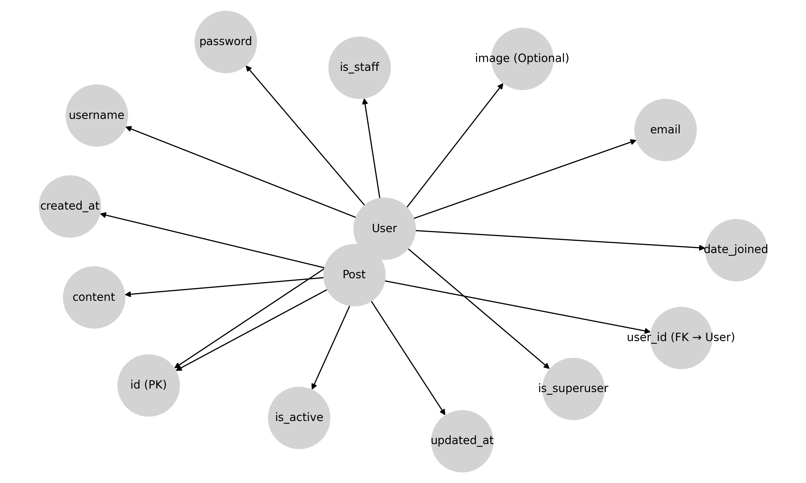

📌 Social Media App

A simple social media application built using Django, HTML, CSS, and JavaScript. This application allows users to register, log in, create posts, and manage their profile.

📌 Features
✔️ User Registration & Authentication  
✔️ Create, Edit, and Delete Posts  
✔️ View All User Posts on Homepage  
✔️ User-Specific Profile Page  
✔️ Responsive Design with Bootstrap  
✔️ Secure Logout  
✔️ Password Reset & Change Functionality  

---

🛠️ Installation & Setup
Follow these steps to set up the project locally.

1️⃣ Clone the Repository:

git clone https://github.com/YOUR_GITHUB_USERNAME/social-media-app.git
cd social-media-app

2️⃣ Create a Virtual Environment (Recommended)

python -m venv venv
source venv/Scripts/activate  # Windows

3️⃣ Install Dependencies

pip install -r requirements.txt

4️⃣ Apply Migrations & Create Database

python manage.py makemigrations
python manage.py migrate

5️⃣ Create Superuser (Optional)

python manage.py createsuperuser

Use:
Username: admin
Password: admin123

6️⃣ Run the Server

python manage.py runserver

Go to `http://127.0.0.1:8000/`

---

🔑 Sample Test Credentials
Use these accounts to test the application:

TestUser #01

Username: shaanmr
Password: shaan2025

TestUser #02

Username: ostadid
Password: ostad2025

---

📌 Entity Relationship Diagram (ERD)
This diagram represents the database structure.

